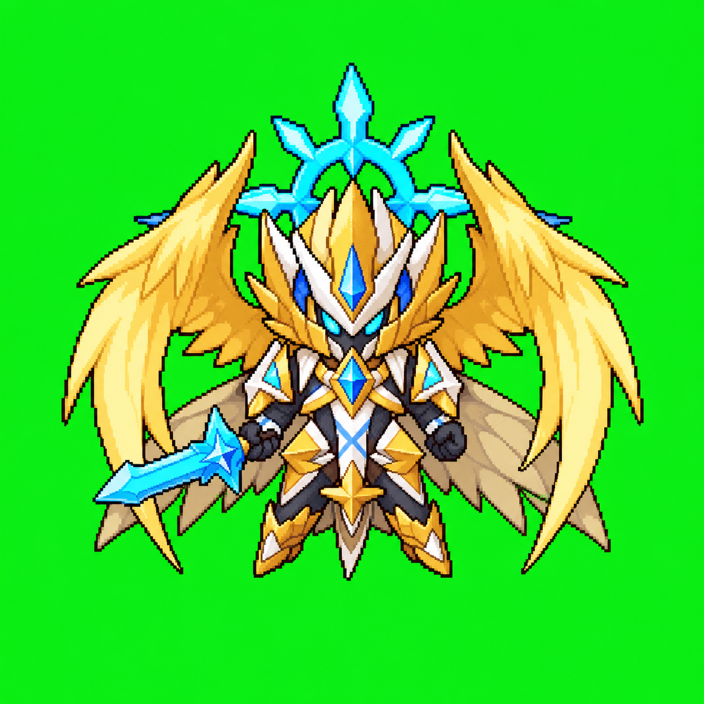
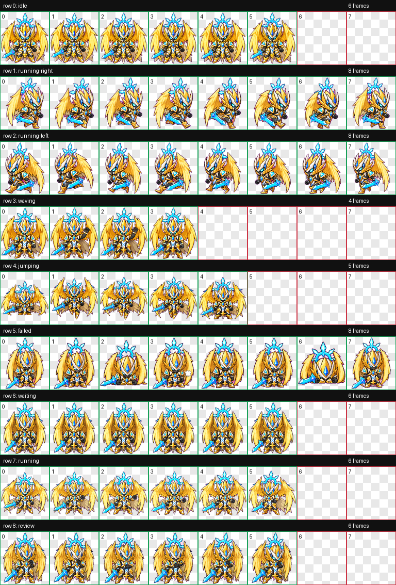

# 觉醒大天使 / Awakened Archangel

## 中文介绍

觉醒大天使是游戏《洛克王国》（Roco Kingdom）中的翼系宠物，也是大天使进阶路线中的觉醒形态。公开资料中将它描述为《洛克王国》的觉醒宠物之一：一阶为“大天使”，二阶为“圣大天使”，三阶形象为“觉醒大天使”。它的代表性视觉特征是巨大的金色羽翼、白金色铠甲、青蓝色水晶冠饰、蓝色宝石与蓝色长剑，整体气质神圣、锋利、强攻感很强。

这份 Codex 宠物版本把原角色改造成适合桌面宠物显示的小型动画形象：保留金翼、铠甲、蓝色水晶和长剑等核心识别点，同时压缩成更紧凑的 chibi sprite 比例，方便在 Codex 宠物窗口中循环播放。

资料参考：

- [百度百科：觉醒大天使](https://baike.baidu.com/item/%E8%A7%89%E9%86%92%E5%A4%A7%E5%A4%A9%E4%BD%BF/17181941)
- [4399 洛克王国觉醒大天使技能表](https://news.4399.com/luoke/luokechongwu/yixi/201504-08-502334.html)

## English Introduction

Awakened Archangel is a Wing-type pet from the game Roco Kingdom. It is the awakened form in the Archangel evolution line: Archangel, Holy Archangel, and finally Awakened Archangel. Public references describe it as one of Roco Kingdom's awakened pets. Its recognizable visual identity includes huge golden wings, white-and-gold armor, cyan crystal ornaments, blue gems, and a blue sword, giving it a sacred, sharp, and aggressive battle style.

This Codex pet adaptation turns the original character into a compact desktop-pet sprite. It keeps the golden wings, armor, cyan crystal crest, and sword as the main identity markers, while compressing the design into chibi sprite proportions that can loop cleanly inside the Codex pet runtime.

References:

- [Baidu Baike: 觉醒大天使](https://baike.baidu.com/item/%E8%A7%89%E9%86%92%E5%A4%A7%E5%A4%A9%E4%BD%BF/17181941)
- [4399 Roco Kingdom skill page](https://news.4399.com/luoke/luokechongwu/yixi/201504-08-502334.html)

## 角色与能力 / Character And Abilities

| 项目 / Item | 内容 / Details |
| --- | --- |
| 中文名 / Chinese name | 觉醒大天使 |
| 英文名 / English name | Awakened Archangel |
| 来源 / Source | 洛克王国 / Roco Kingdom |
| 属性 / Type | 翼系 / Wing |
| 进阶路线 / Evolution line | 大天使 -> 圣大天使 -> 觉醒大天使 |
| 代表技能 / Signature skills | 天使觉醒、圣炎、审判、天罚 |
| 视觉关键词 / Visual keywords | 金色羽翼、白金铠甲、青蓝水晶冠饰、蓝色长剑 |

## 动作总览 / Animation Contact Sheet

## 动作状态 / Animation States

| State / 状态 | Frames / 帧数 | Notes / 说明 |
| --- | ---: | --- |
| idle / 待机 | 6 | Calm breathing and small idle motion / 平静呼吸和轻微待机动作 |
| running-right / 向右移动 | 8 | Right-facing movement row / 向右移动动作 |
| running-left / 向左移动 | 8 | Generated separately instead of mirrored / 单独生成，没有直接镜像 |
| waving / 挥手 | 4 | Arm or hand wave without detached marks / 只用手部姿势表达挥手，没有额外符号 |
| jumping / 跳跃 | 5 | Vertical body motion without floor effects / 只用身体高度变化表现跳跃 |
| failed / 失败 | 8 | Failure reaction without red X marks or detached symbols / 失败反应，没有红叉或漂浮符号 |
| waiting / 等待 | 6 | Calm waiting loop / 平静等待循环 |
| running / 进行中 | 6 | Active in-progress loop, not literal foot-running / 表示任务进行中，不是横向奔跑 |
| review / 审查 | 6 | Focused review pose without extra UI props / 专注审查动作，不添加 UI 道具 |

## 资源 / Assets

- [Character image / 形象图](assets/character.png)
- [Contact sheet / 动作总览图](assets/contact-sheet.png)
- [PNG spritesheet](assets/spritesheet.png)
- [WebP spritesheet](assets/spritesheet.webp)
- [Validation report / 验证报告](assets/validation.json)

## 验证结果 / Validation

- Format: WebP / RGBA
- Size: 1536 x 1872
- Cell size: 192 x 208
- Errors: none
- Warnings: none

由于本地环境缺少视频编码工具，本次跳过了 MP4 预览，但 spritesheet 和 QA 动作总览图已经成功生成。

MP4 previews were skipped because the local environment did not have the video encoder available, but the spritesheet and QA contact sheet were generated successfully.
