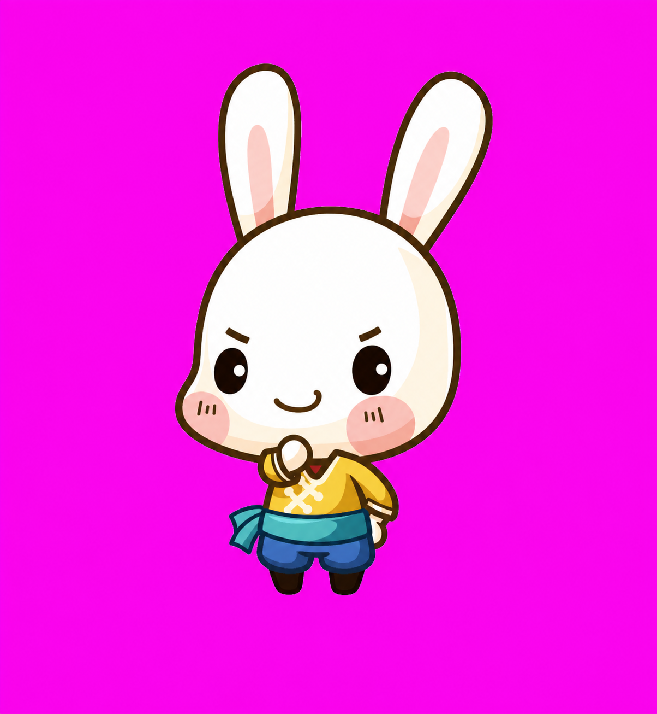
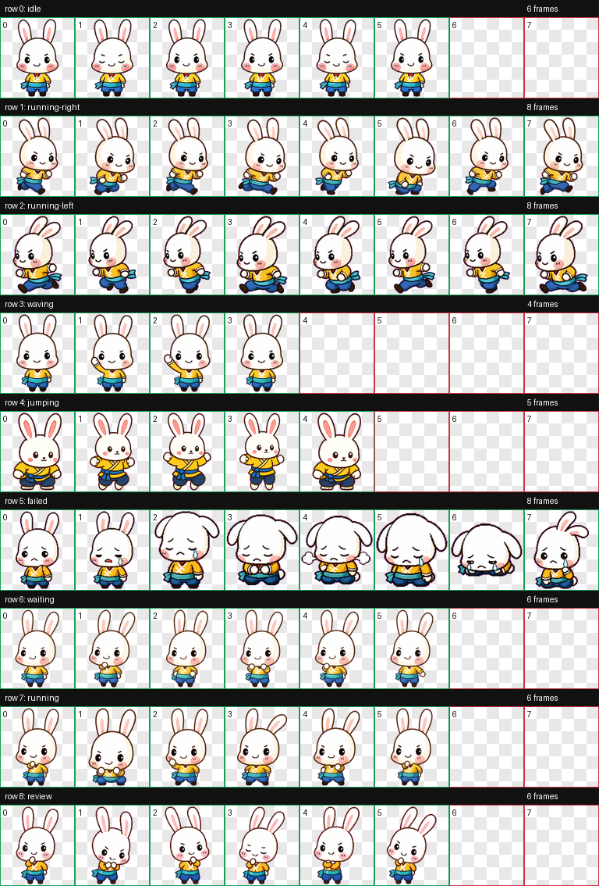

# 少林呱呱 / Shaolin Guagua

## 中文介绍

少林呱呱是游戏《洛克王国》（Roco Kingdom）中的呱呱系列宠物形象之一。公开资料中把它呈现为具有少林武学气质的呱呱形态，代表性视觉特征包括白色长耳、粉色内耳、圆润脸颊、黄色少林服、蓝色腰带和小拳头武学姿态。

这份 Codex 宠物版本把原角色改造成适合桌面宠物显示的小型动画形象，尽量保留参考图中的白色长耳、黄衣蓝腰带、粉色脸颊和可爱的少林练功气质，同时压缩成紧凑的 chibi sprite 比例。

标准可用宠物包在这里：[shaolin-guagua](../../shaolin-guagua/)

资料参考：

- [4399 洛克王国少林呱呱百科](https://news.4399.com/luoke/luokechongwu/shuixi/201101-18-84854.html)

## English Introduction

Shaolin Guagua is a Guagua-series pet from the game Roco Kingdom. Public reference material presents it as a Shaolin martial-arts themed form, with recognizable visual traits including long white ears, pink inner ears, round cheeks, a yellow Shaolin outfit, a blue waist sash, and a small fist martial pose.

This Codex pet adaptation turns the original character into a compact desktop-pet sprite while keeping the key identity markers readable at small size: the white long-eared silhouette, yellow-and-blue outfit, pink cheeks, and cute Shaolin training personality.

The standard installable pet package is here: [shaolin-guagua](../../shaolin-guagua/)

References:

- [4399 Roco Kingdom Shaolin Guagua page](https://news.4399.com/luoke/luokechongwu/shuixi/201101-18-84854.html)

## 角色与能力 / Character And Abilities

| 项目 / Item | 内容 / Details |
| --- | --- |
| 中文名 / Chinese name | 少林呱呱 |
| 英文名 / English name | Shaolin Guagua |
| 来源 / Source | 洛克王国 / Roco Kingdom |
| 主题 / Theme | 少林武学 / Shaolin martial arts |
| 视觉关键词 / Visual keywords | 白色长耳、粉色内耳、黄色少林服、蓝色腰带、粉色脸颊、小拳头 |

## 动作总览 / Animation Contact Sheet

## 动作状态 / Animation States

| State / 状态 | Frames / 帧数 | Notes / 说明 |
| --- | ---: | --- |
| idle / 待机 | 6 | Calm breathing and blink loop / 平静呼吸和眨眼待机动作 |
| running-right / 向右移动 | 8 | Right-facing movement row / 向右移动动作 |
| running-left / 向左移动 | 8 | Generated separately instead of mirrored / 单独生成，没有直接镜像 |
| waving / 挥手 | 4 | Paw-only wave without detached marks / 只用手部姿势表达挥手，没有额外符号 |
| jumping / 跳跃 | 5 | Vertical body motion without floor effects / 只用身体高度变化表现跳跃 |
| failed / 失败 | 8 | Sad failure reaction with attached tears or puffs only / 失败反应，只保留贴身眼泪或小烟 puff |
| waiting / 等待 | 6 | Calm waiting loop / 平静等待循环 |
| running / 进行中 | 6 | Active in-progress loop, not literal foot-running / 表示任务进行中，不是横向奔跑 |
| review / 审查 | 6 | Focused review pose without extra UI props / 专注审查动作，不添加 UI 道具 |

## 资源 / Assets

- [Character image / 形象图](assets/character.png)
- [Contact sheet / 动作总览图](assets/contact-sheet.png)
- [PNG spritesheet preview](assets/spritesheet.png)
- [Installable WebP spritesheet](../../shaolin-guagua/spritesheet.webp)
- [pet.json](../../shaolin-guagua/pet.json)
- [Validation report / 验证报告](assets/validation.json)

## 验证结果 / Validation

- Format: WebP / RGBA
- Size: 1536 x 1872
- Cell size: 192 x 208
- Errors: none
- Warnings: none

由于本地环境缺少视频编码工具，本次跳过了 MP4 预览，但 spritesheet、验证记录和 QA 动作总览图已经成功生成。

MP4 previews were skipped because the local environment did not have the video encoder available, but the spritesheet, validation report, and QA contact sheet were generated successfully.
